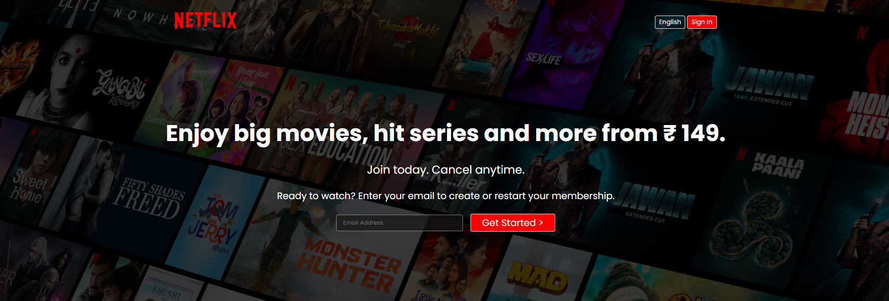
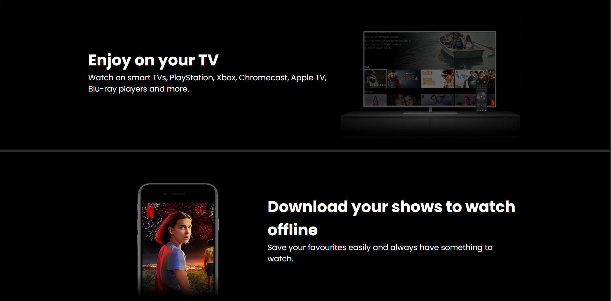
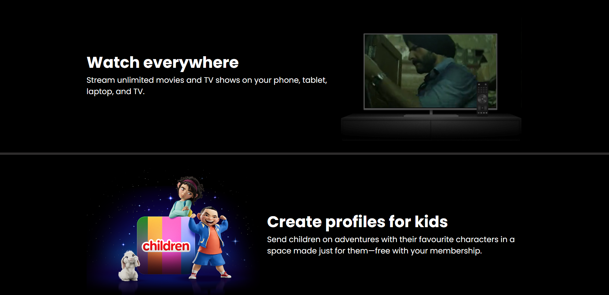
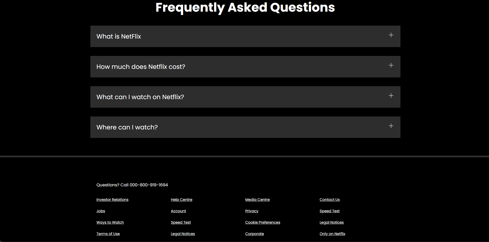

# Netflix Clone

This is a simple Netflix Clone project built using HTML and CSS. It replicates the basic layout and styling of the Netflix home page.

## Features
- Responsive design to adapt to various screen sizes.

## Technologies Used
- **HTML5**: For the structure of the website.
- **CSS3**: For styling the components and layout.

---

## Screenshots

### Screenshot 1

### Screenshot 2

### Screenshot 3

### Screenshot 4

